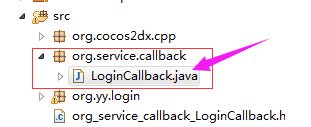
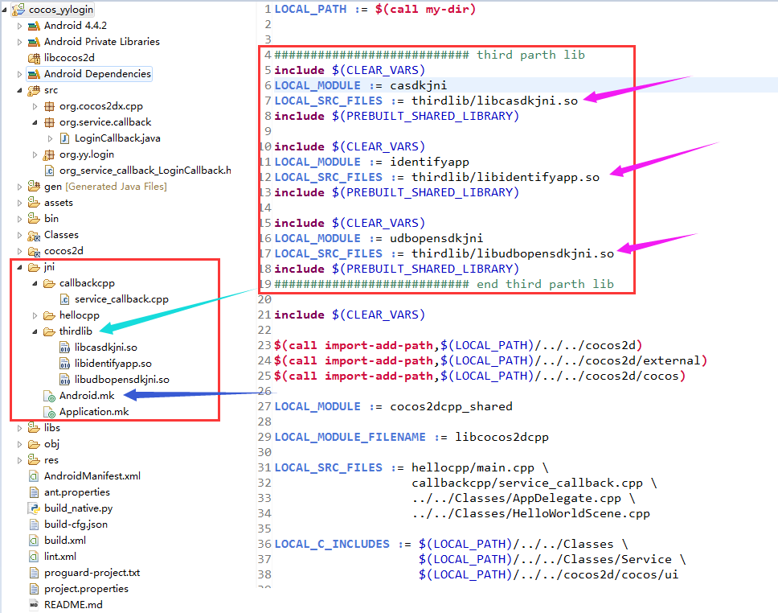
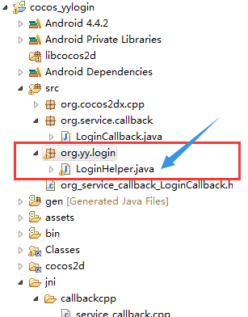

#C++和JAVA的相互调用
##一、Java中调用C++函数
### Java中有回调需要调用C++的实现
==以YY登录为例子==
**1、**在Android工程中添加了一个callback的package，并创建`LoginCallback.java`，代码如下：
```java
	package org.service.callback;

	public class LoginCallback {
		public static native void onLoginSuccess();
		public static native void onLoginFailure();
	}
```


**2、**打开CMD，切换到`yourproject\proj.android\bin\classes`目录，运行下面命令：
> 	
	javah org.service.callback.LoginCallback

会在`proj.android\bin\classes`目录下生产一个`org_service_callback_LoginCallback.h`文件，文件内容为：
```c++
/* DO NOT EDIT THIS FILE - it is machine generated */
#include <jni.h>
/* Header for class org_service_callback_LoginCallback */

#ifndef _Included_org_service_callback_LoginCallback
#define _Included_org_service_callback_LoginCallback
#ifdef __cplusplus
extern "C" {
#endif
/*
 * Class:     org_service_callback_LoginCallback
 * Method:    onLoginSuccess
 * Signature: ()V
 */
JNIEXPORT void JNICALL Java_org_service_callback_LoginCallback_onLoginSuccess
  (JNIEnv *, jclass);

/*
 * Class:     org_service_callback_LoginCallback
 * Method:    onLoginFailure
 * Signature: ()V
 */
JNIEXPORT void JNICALL Java_org_service_callback_LoginCallback_onLoginFailure
  (JNIEnv *, jclass);

#ifdef __cplusplus
}
#endif
#endif
```
**3、**创建上面的.h文件中函数的实现cpp文件
将上面生成的.h文件拷贝到src目录下，并在jni目录中创建如图所示的文件

其中service_callback.cpp文件的内容如下：
```cpp
/*
 * service_callback.cpp
 *
 *  Created on: 2015年1月6日
 *      Author: wangzs
 */
 // 对前面生成并拷贝到src目录下的.h文件引用
#include "../../src/org_service_callback_LoginCallback.h"
#include "cocos2d.h"
#include "platform/android/jni/JniHelper.h"
#include <jni.h>
#include <android/log.h>

#define  LOG_TAG    "main"
#define  LOGD(...)  __android_log_print(ANDROID_LOG_DEBUG,LOG_TAG,__VA_ARGS__)

using namespace cocos2d;

//TODO 实际的回调功能
JNIEXPORT void JNICALL Java_org_service_callback_LoginCallback_onLoginSuccess (JNIEnv *, jclass) {
	LOGD("LoginCallback Success!!!");
}

JNIEXPORT void JNICALL Java_org_service_callback_LoginCallback_onLoginFailure (JNIEnv *, jclass) {
	LOGD("LoginCallback Failure!!!");
}
```
==需要将此cpp添加到Android.mk中==
修改部分如下：
```code
LOCAL_SRC_FILES := hellocpp/main.cpp \
				   callbackcpp/service_callback.cpp	\	# 添加刚刚实现的cpp
                   ../../Classes/AppDelegate.cpp \
                   ../../Classes/HelloWorldScene.cpp
```

**4、** 现在可以在Java代码中调用LoginCallback.java中的native函数了，其函数的实现可以在cpp中作修改。


##二、C++中调用Java
### Java的第三方SDK封装
==以YY登陆为例==
* Jar包的添加
将`alipaysdk.jar, android-support-v4.jar, androidsystem-1.0.3.jar, armeabi, hiido_statis-3.0.3.jar, mmbilling.2.4.0.jar, netroid-sdk-1.2.12.jar, udbopensdk-1.3.3.jar, ymsdk-2.0.4.jar, YYGameSdkCommon-2.2.0.jar, YYGameSdkExt-2.2.0.jar`添加到libs中，并配置好工程属性。
* so库的添加
直接将`libudbopensdkjni.so, libidentifyapp.so, libcasdkjni.so`三个so文件拷贝到`lib\armeabi`会在编译时被清空，即出现<strong style="background:red">cocos2dx项目移植android平台使用第三方so库被删掉的问题</strong>，解决方法：
> 1. 将so拷贝到`jni\thirdlib`目录中（thirdlib名字任意起）
> 2. 修改`Android.mk`文件：

	``` python
	LOCAL_PATH := $(call my-dir)

	########################### third parth lib
	include $(CLEAR_VARS)
	LOCAL_MODULE := casdkjni
	LOCAL_SRC_FILES := thirdlib/libcasdkjni.so
	include $(PREBUILT_SHARED_LIBRARY)

	include $(CLEAR_VARS)
	LOCAL_MODULE := identifyapp
	LOCAL_SRC_FILES := thirdlib/libidentifyapp.so
	include $(PREBUILT_SHARED_LIBRARY)

	include $(CLEAR_VARS)
	LOCAL_MODULE := udbopensdkjni
	LOCAL_SRC_FILES := thirdlib/libudbopensdkjni.so
	include $(PREBUILT_SHARED_LIBRARY)
	
	## 注意：include $(PREBUILT_SHARED_LIBRARY)与include $(PREBUILT_STATIC_LIBRARY)区别
	########################### end third parth lib

	include $(CLEAR_VARS)

	$(call import-add-path,$(LOCAL_PATH)/../../cocos2d)
	$(call import-add-path,$(LOCAL_PATH)/../../cocos2d/external)
	$(call import-add-path,$(LOCAL_PATH)/../../cocos2d/cocos)
	```


* 对第三方SDK的Java包裹，此处定义了LoginHelper类


```java
package org.yy.login;

import org.cocos2dx.cpp.AppActivity;
import org.cocos2dx.lib.Cocos2dxActivity;
import org.service.callback.LoginCallback;

import android.app.Activity;
import android.util.Log;
import android.widget.Toast;

import com.yy.gamesdk.AppInfo;
import com.yy.gamesdk.LoginInfo;
import com.yy.gamesdk.YYGame;
import com.yy.gamesdk.YYGameSDKScreenOrientation;
import com.yy.gamesdk.callbacks.YYGameSDKCallback;
import com.yy.gamesdk.callbacks.YYGameSDKErrorCode;

public class LoginHelper {
	private static String TAG = "LoginHelper";
	static LoginHelper mInstance = null;

	static LoginHelper getInstance() {
		if (mInstance == null)
			mInstance = new LoginHelper();
		return mInstance;
	}

	public LoginHelper() {
		// TODO Auto-generated constructor stub
		initSDK();
	}

	private void initSDK() {
		// 因为第三方SDK库中会用到界面显示功能，需要将相关代码运行在UI线程
		((Activity)(AppActivity.getContext())).runOnUiThread(new Runnable() {
			@Override
			public void run() {

			}
		});
	}

	public static void initYYGameSDK() {
		LoginHelper.getInstance();
	}

	public static void loginByYY() {
		Log.e(TAG, "======================> LoginByYY");
	}
}
```

* 定义C\++的接口
将Java中封装的接口在C++层面进行封装，此处使用Cocos2dx提供的JniHelper类
在Classes目录下创建了LoginService.h文件，如图所示：

代码如下：

```cpp
#ifndef LGOINSERVICE_H_
#define LGOINSERVICE_H_

#if (CC_TARGET_PLATFORM == CC_PLATFORM_ANDROID)
#include <jni.h>
#include <../cocos2d/cocos/platform/android/jni/JniHelper.h>

#if 1
#define  LOG_TAG    "JniHelper"
#define  LOGD(...)  __android_log_print(ANDROID_LOG_DEBUG,LOG_TAG,__VA_ARGS__)
#else
#define  LOGD(...)
#endif
#endif

#include <iostream>
USING_NS_CC;

static JniMethodInfo jniInfo;
void Service_Login() {
	bool ret = JniHelper::getStaticMethodInfo(jniInfo, "org/yy/login/LoginHelper", "loginByYY", "()V");
	if (ret) {
		jniInfo.env->CallStaticVoidMethod(jniInfo.classID, jniInfo.methodID);
	}
}

void Service_InitYYGameSDK() {
	bool ret = JniHelper::getStaticMethodInfo(jniInfo, "org/yy/login/LoginHelper", "initYYGameSDK", "()V");
		if (ret) {
			jniInfo.env->CallStaticVoidMethod(jniInfo.classID, jniInfo.methodID);
		}
}

#endif
```

==完成上述步骤，即可在Cocos2dx相关C\++文件中调用LoginService.h中封装了Java实现的C++函数接口==


