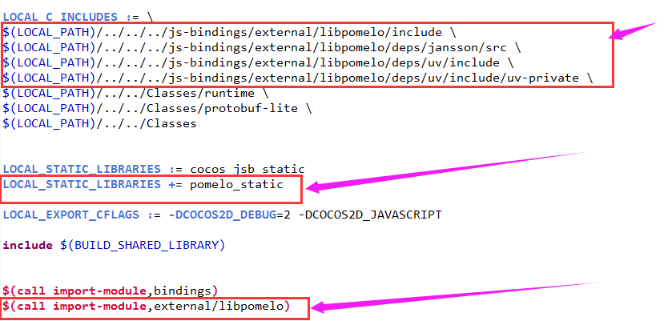
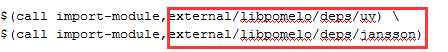

# libpomelo加入到Cocos2d-js 3.1中
## Android平台
cocos2d-js项目的Android工程的`jni\Android.mk`修改如下：


libpomelo目录中Android.mk修改如下：

圈住的部分根据实际libpomelo目录所在位置进行相应配置（具体可参照jin\Android.mk中自带的配置进行相应目录的参考配置）


变更libpomelo的路径时，修改上面图中对应的路径，同时进入`proj.android\obj\local\armeabi`目录中，清除编译出来的中间文件，不然可能再次编译会出现编译失败的问题。

## Win32平台
主要需要安装gyp，具体参考：
```
in your libpomelo project root directory
open git bash and type in

mkdir -p build
git clone https://github.com/martine/gyp.git build/gyp
then open cmd shell in windows and cd to your libpomelo project root directory
and type in

build\gyp\gyp.bat --depth=. pomelo.gyp -Dlibrary=static_library -DTO=pc
then open pomelo.sln in visual studio and you can build libpomelo in windows
```
执行完，生产vs工程，用vs打开，编译会生产`libuv.lib`、`libpomelo.lib`和`jansson.lib`三个库，将这些库引用到cocos的vs工程中即可（相关的路径和lib引用的配置问题）

## Mac 或 IOS平台
参考：
```
Mac
./pomelo_gyp
xcodebuild -project pomelo.xcodeproj
IOS
./pomelo_gyp -DTO=ios
./build_ios
IOS Simulator
./pomelo_gyp -DTO=ios
./build_iossim
```