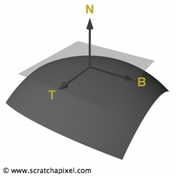

# Geometry
## 一、Points、Vectors和Normals
#### 1.1 Algebra中的vector
向量是由多个元素组成的tuple，下面的是有六个元素的vector：
$$V={a,b,c,d,e,f}  &nbsp;&nbsp;&nbsp;&nbsp; 其中(a,b,c,d,e,d)为实数$$
在CG中可以使用上面的向量表示points和vectors

#### 1.2 Points和Vectors
* Point此处指的是3D空间中某个位置position
* Vector表示3D空间中的一个方向direction
<center></center>
Points和Vectors在Algebra中均用下面的公式表示：
$$V={a,b,c}$$
一般为了数学上方便，会将point转为齐次坐标系下的表示（齐次坐标点在点与矩阵相乘时很有用）：
$$P_H=(x, y, z, w)$$

#### 1.3 转换Transformations
Transformation主要有translation、rotation和scale
* translation作用的对象是points，对于vector的translation是无效的，因为vector是方向，与具体位置无关。
* rotation作用的对象是vector，点是没有方向的概念所以没法使用rotation
$$P \rightarrow Translate \rightarrow P_T\\ V \rightarrow Rotate \rightarrow V_T$$
公式中的下标T表示transformed。

在CG中向量的长度很重要，vector的长度为1，则称此vector是**normalised**。对普通的vector进行normalised操作，其原始的方向不变，只是其length变为了1。
有时候，vector需要normalised，有时候需要保持其原始length不能进行normalised。在normalised时需要主要是否会有问题。

#### 1.4 法线Normals
法线是用来描述面上某个点的朝向。即某个surface上有个点**P**，该点的Normal垂直于surface上**P**点的切平面。


#### 1.5 C++中如何表示
point、vector和normal在c++中都用Vec3类表示
```c++
template<typename T>
class Vec3
{
public:
    // 3 most basic ways of initializing a vector
    Vec3() : x(T(0)), y(T(0)), z(T(0)) {}
    Vec3(const T &xx) : x(xx), y(xx), z(xx) {}
    Vec3(T xx, T yy, T zz) : x(xx), y(yy), z(zz) {}
    T x, y, z;
};

typedef Vec3<float> Vec3f;
```

## 二、坐标系统Coordinate System
#### 2.1 维度和笛卡尔坐标系（Dimension and Cartesian Coordinate System）
给定两个相互垂直的轴，可以组成一个二维的坐标系，并称该坐标系为Cartesian Coordinate System。
* 确定笛卡尔坐标系后，坐标系中的同一个点的定义是唯一的。
* 同一个点再不同的坐标系中的表示是不同的，在一直两个坐标系以及某个坐标系中点的位置，可以将当前的坐标系下的位置转为另一个坐标系下表示。

#### 2.2 三维坐标系
三维坐标系是在二维坐标系的基础上再添加一个z轴，并且垂直于x、y轴，使用右手法则，z轴的朝向是有里指向外。


#### 2.3 世界坐标系
世界坐标系是整个场景的坐标系，不同的object、camera等之间的相对位置都在世界坐标系中体现。
不同于世界坐标系的的坐标系有：局部坐标系（object坐标系）、相机坐标系（camera视角中的世界）、屏幕坐标系。


## 三、Points和Vectors的计算
#### 3.1 vector类的C++表示
```c++
template<typename T>
class Vec3
{
public:
    // 3 most basic ways of initializing a vector
    Vec3() : x(T(0)), y(T(0)), z(T(0)) {}
    Vec3(const T &xx) : x(xx), y(xx), z(xx) {}
    Vec3(T xx, T yy, T zz) : x(xx), y(yy), z(zz) {}
    T x, y, z;
};
```

#### 3.2 Vector的Length
vector可以看成是以某个点为起点，另一个点为终点的arrow。该vector不进表示了方向，同时也表示了两点之间的距离，计算如下：
$$
||V|| = \sqrt{V.x * V.x + V.y * V.y + V.z * V.z}
$$
计算length的C++代码：
```c++
template<typename T>
T length(const Vec3<T> &v) {
	return sqrt(v.x * v.x + v.y * v.y + v.z * v.z);
}
```

#### 3.3 Normalizing a Vector
vector的长度为1成为unit vector。对一个普通向量进行normalised的公式如下：
$$
 \hat{V} = {V \over { || V || }}
$$
<center></center>

在C++中对vector进行normalised处理时，注意使用一个优化技巧，计算出length时，取倒数与vector相乘。
```c++
template<typename T>
void normalize(Vec3<T> &v)
{
    T len2 = v.x * v.x + v.y * v.y + v.z * v.z;
    // avoid division by 0
    if (len2 > 0) {
        T invLen = 1 / sqrt(len2);
        x *= invLen, y *= invLen, z *= invLen;
    }
}
```

#### 3.4 Dot product（点乘）
两个向量之间的点乘得到的结果是一个实数。其值除以它们length的乘积表示了两个向量之间的**夹角的cos值**。一般表示<i>**A·B**</i>，其具体的计算公式如下：
$$
A \cdot B = A.x * B.x + A.y * B.y + A.z * B.z
$$
<center></center>

如果**A=B**，则它们的点乘的开平方值就是向量的长度：
$$
||V||^2=V \cdot V
$$
对应的c++计算代码：
```c++
template<typename T>
T dot(const Vec3<T> &a, const Vec3<T> &b)
{
	return a.x * b.x + a.y * b.y + a.z * b.z;
}
```
两个向量之间的夹角计算公式：
$$
\theta = \cos^{-1}({{A \cdot B} / {||A||\:||B||}})
$$
dot product应该广泛，可以判断两个向量是否垂直或者是否共线。如果点乘的结果为0，则表示向量互相垂直；如果值为-1，表示两个向量反向；如果值为1，则表示两个向量指向同一个方向。
<center></center>

#### 3.5 Cross Product（叉乘）
**A、B**两个向量的叉乘得到的结果仍然是一个vector，并且该vector与**A、B**两个两个向量垂直（满足右手法则）；
$$
 C = A \times B \\
 \begin{array}{l}
C_X = A_Y * B_Z - A_Z * B_Y \\
C_Y = A_Z * B_X - A_X * B_Z \\
C_Z = A_X * B_Y - A_Y * B_X \\
\end{array}
$$
<center></center>
<center></center>

C++中计算叉乘的代码如下：
```c++
template<typename T>
Vec3<T> cross(const Vec3<T>  &a, const Vec3<T> &b)
{
return Vec3<T>(
        a.y * b.z - a.z * b.y,
        a.z * b.x - a.x * b.z,
        a.x * b.y - a.y * b.x);
}
```

#### 3.6 向量的加减法
```c++
 Vec3<T> operator + (const Vec3<T> &v) const
    { return Vec3<T>(x + v.x, y + v.y, z + v.z); }
    Vec3<T> operator - (const Vec3<T> &v) const
    { return Vec3<T>(x - v.x, y - v.y, z - v.z); }
    Vec3<T> operator * (const T &r) const
    { return Vec3<T>(x * r, y * r, z * r); }
```

## 四、矩阵（Matrix）
http://www.scratchapixel.com/lessons/mathematics-physics-for-computer-graphics/geometry/matrices


## 五、


## 六、


<script type="text/javascript" src="http://cdn.mathjax.org/mathjax/latest/MathJax.js?config=default"></script>


