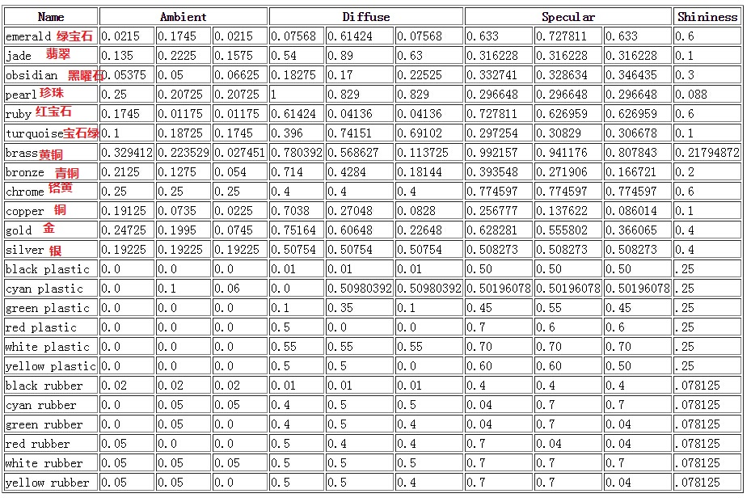

# Lighting

-----

## 一、颜色
颜色的叠加：
```code
glm::vec3 lightColor(0.33f, 0.42f, 0.18f);
glm::vec3 toyColor(1.0f, 0.5f, 0.31f);
glm::vec3 result = lightColor * toyColor; // = (0.33f, 0.21f, 0.06f);

glm::vec3 lightColor(1.0f, 1.0f, 1.0f);
glm::vec3 toyColor(1.0f, 0.5f, 0.31f);
glm::vec3 result = lightColor * toyColor; // = (1.0f, 0.5f, 0.31f);
```


## 二、Phong lighting model
由三部分组成：环境光(ambient)、漫反射(diffuse)、高光(specular)
### 1.环境光ambient
简化光照模型，使用一个常量的ambient系数来表示环境光因素
```code
float ambientStrength = 0.1f;

vec3 ambientColor = ambientStrength * lightColor;
```

### 2.漫反射diffuse
物体的面朝向光源，表面会越亮。如果光线垂直于表面，则亮度最高。
需要两个参数：
* 表面的法向量：垂直于表面的向量
* The directed light ray：光源的位置与fragment's position

```code
// norm为normalize后的面的法向量， lighDir为fragment点位置到光源的向量
// 由dot(norm, lightDir)，可以看出，如果光源平行或背对表面，表面为黑；当垂直表面时，光亮最强
float diff = max(dot(norm, lightDir), 0.0);

vec3 diffColor = diff * lightColor;
```

### 3.高光Specular
高光是通过计算光源的反射光线与眼睛(相机)的观察视线之间的夹角来计算的。夹角越小，强度越高。同时，也有一个高光的强度因子。
```code
float specularStrength = 0.5;
vec3 viewDir = vec3(viewPos, fragPos);
vec3 reflectDir = reflect(-lightDir, norm);	// 计算光源入射到表面的向量与法线后的反射光线
float spec = pow(max(dot(viewDir, reflectDir)), 32);

vec3 specColor = specularStrength * spec * lightColor;
```

Phone光照模型的最后颜色计算：
```code
color = (ambientColor + diffColor + specColor) * objectColor;
```


## 三、材质Materials
不同的材质，对于Phone lighting模型，三个参数的值不同。
一些参考材质的参数：

材质的颜色主要受light属性和自身的属性影响。
==材质属性设置：==
```code
// shader
struct Material {
    vec3 ambient;
    vec3 diffuse;
    vec3 specular;
    float shininess;
};
uniform Material material;


// opengl material
GLint matAmbientLoc = glGetUniformLocation(shader.shader_program(), "material.ambient");
GLint matDiffuseLoc = glGetUniformLocation(shader.shader_program(), "material.diffuse");
GLint matSpecularLoc = glGetUniformLocation(shader.shader_program(), "material.specular");
GLint matShineLoc = glGetUniformLocation(shader.shader_program(), "material.shininess");
glUniform3f(matAmbientLoc, 0.0f, 0.1f, 0.06f);
glUniform3f(matDiffuseLoc, 0.0f, 0.50980392f, 0.50980392f);
glUniform3f(matSpecularLoc, 0.50196078f, 0.50196078f, 0.50196078f);
glUniform1f(matShineLoc, 32);
```
==light的属性设置==
```code
// shader
struct Light {
    vec3 position;

    vec3 ambient;
    vec3 diffuse;
    vec3 specular;
};
uniform Light  light;

// opengl light
GLint lightAmbientLoc = glGetUniformLocation(shader.shader_program(), "light.ambient");
GLint lightDiffuseLoc = glGetUniformLocation(shader.shader_program(), "light.diffuse");
GLint lightSpecularLoc = glGetUniformLocation(shader.shader_program(), "light.specular");
glUniform3f(lightAmbientLoc, 1.0f, 1.0f, 1.0f);
glUniform3f(lightDiffuseLoc, 1.0f, 1.0f, 1.0f); // Let's darken the light a bit to fit the scene
glUniform3f(lightSpecularLoc, 1.0f, 1.0f, 1.0f);
```

## 四、光照贴图Lighting Maps
#### 1.漫反射贴图diffuse maps
diffuse maps的使用主要是针对于上面的shader中物品表面的颜色用纹理代替
```code
struct Material {
    sampler2D diffuse;		// ambient和diffuse的属性都是用纹理中的值
    vec3 specular;
    float shininess;
};
 // ambient
vec3 ambient = light.ambient * vec3(texture(material.diffuse, fragTexCoord));
// diffuse
vec3 norm = normalize(Normal);
vec3 lightDir = normalize(lightPos-FragPos);
float diff = max(dot(lightDir, norm), 0.0);
vec3 diffuse = light.diffuse * diff * vec3(texture(material.diffuse, fragTexCoord));

// opengl程序中，设置fragTexCoord纹理坐标以及给material.diffuse对应的纹理指定图像资源
glUniform1i(glGetUniformLocation(lightingShader.Program, "material.diffuse"), 0);
glActiveTexture(GL_TEXTURE0);
glBindTexture(GL_TEXTURE_2D, diffuseMap);	// diffuseMap图片资源
```

#### 2.高光贴图specular maps
高光贴图的主要作用是：对于某些不反光材质，使其没有高光效果，如木质属性的材质。
这样就可以做到哪些地方可以在光线照射后，具有光亮的显示效果。
```code
struct Material {
    sampler2D diffuse;
    sampler2D specular;
    float shininess;
};
// specular
vec3 viewDir = normalize(viewPos - FragPos);
vec3 reflectDir = reflect(-lightDir, norm);
float spec = pow(max(dot(viewDir, reflectDir), 0.0), material.shininess);
vec3 specular = light.specular * spec * vec3(texture(material.specular, fragTexCoord));

glUniform1i(glGetUniformLocation(lightingShader.Program, "material.specular"), 1);
glActiveTexture(GL_TEXTURE1);
glBindTexture(GL_TEXTURE_2D, specularMap);
```
#### 3.辐射纹理emission maps
辐射纹理一般是用在一些有发光效果的物体上，如游戏中一些怪物的绿色的眼睛等。
```code
// emission map
vec3 emission = vec3(texture(emission_map, fragTexCoord));
color = vec4(emission + ambient + diffuse + specular, 1.0);

glUniform1i(glGetUniformLocation(lightingShader.Program, "emission_map"), 1);
glActiveTexture(GL_TEXTURE1);
glBindTexture(GL_TEXTURE_2D, emissionMap);
```

## 五、光源的几种类型
#### 1.平行光Directional Lights
跟位置无关，主要是方向属性，如太阳。
```code
struct Light {
    // vec3 position; // No longer necessery when using directional lights.
    vec3 direction;
    vec3 ambient;
    vec3 diffuse;
    vec3 specular;
};

// 可以定义direction类型为vec4，这样就可以通过判断最后一个参数w是否为零，
	来判断是是否为平行光。（以前的固定管线即是通过这样判断光源为点光还是平行光）
```

#### 2.点光源Point Lights
点光源的一个主要特征是衰变，随着距离的增加，光照强度减弱，
```code
Distance    Constant    Linear  Quadratic
7           1.0         0.7     1.8
13          1.0         0.35    0.44
20          1.0         0.22    0.20
32          1.0         0.14    0.07
50          1.0         0.09    0.032
65          1.0         0.07    0.017
100         1.0         0.045   0.0075
160         1.0         0.027   0.0028
200         1.0         0.022   0.0019
325         1.0         0.014   0.0007
600         1.0         0.007   0.0002
3250        1.0         0.0014  0.000007
```
三个参数：Kc常亮参数一般为1.0， 线性衰减参数Kl和二次衰减参数Kq
衰减的光照强度值计算公式：Fatt=I/(Kc+Kl∗d+Kq∗d^2)
具体实现代码：
```code
struct Light {
    vec3 position;
    vec3 ambient;
    vec3 diffuse;
    vec3 specular;

    float constant;
    float linear;
    float quadratic;
};

glUniform1f(glGetUniformLocation(lightingShader.Program, "light.constant"),  1.0f);
glUniform1f(glGetUniformLocation(lightingShader.Program, "light.linear"),    0.09);
glUniform1f(glGetUniformLocation(lightingShader.Program, "light.quadratic"), 0.032);

float distance    = length(light.position - Position);
float attenuation = 1.0f / (light.constant + light.linear * distance +
    		    light.quadratic * (distance * distance));
// attenuation与Phone模型的各参数相乘，再计算ambient、diffuse和specular
```
#### 3.聚光灯Spotlight
聚光灯的属性：spotlight的position、spotlight的指向、spotlight的内夹角和外夹角（外夹角使用时为了使的外围的光照效果柔和，更加符合真实情况的聚光灯的效果）。
```code
struct Light {
    vec3  position;
    vec3  direction;
    float cutOff;
    float outerCutOff;

    vec3 ambient;
    vec3 diffuse;
    vec3 specular;
};

vec3 norm = normalize(Normal);
vec3 lightDir = normalize(light.position - FragPos);

float theta = dot(lightDir, normalize(-light.direction));
float epsilon = light.cutOff - light.outerCutOff;
float intensity = clamp((theta - light.outerCutOff)/epsilon, 0.0, 1.0);
// 最后将intensity与diffuse和specular的系数相乘
```

## 六、多光源系统
主要是不同光源对fragment的颜色叠加，最后的颜色即为多光源下的渲染结果。
对于不同的光源，应该将计算颜色封装为对应光源的计算函数：
```code
// ========================>>> directional light <<<======================== //
struct DirLight {
    vec3 direction;
    vec3 ambient;
    vec3 diffuse;
    vec3 specular;
};
uniform DirLight dirLight;

vec3 CalcDirLight(DirLight light, vec3 normal, vec3 viewDir)
{
    vec3 lightDir = normalize(-light.direction);
    // Diffuse shading
    float diff = max(dot(normal, lightDir), 0.0);
    // Specular shading
    vec3 reflectDir = reflect(-lightDir, normal);
    float spec = pow(max(dot(viewDir, reflectDir), 0.0), material.shininess);
    // Combine results
    vec3 ambient  = light.ambient  * vec3(texture(material.diffuse, TexCoords));
    vec3 diffuse  = light.diffuse  * diff * vec3(texture(material.diffuse, TexCoords));
    vec3 specular = light.specular * spec * vec3(texture(material.specular, TexCoords));
    return (ambient + diffuse + specular);
}


// ========================>>> point light <<<======================== //
struct PointLight {
    vec3 position;
    float constant;
    float linear;
    float quadratic;
    vec3 ambient;
    vec3 diffuse;
    vec3 specular;
};
// Calculates the color when using a point light.
vec3 CalcPointLight(PointLight light, vec3 normal, vec3 fragPos, vec3 viewDir)
{
    vec3 lightDir = normalize(light.position - fragPos);
    // Diffuse shading
    float diff = max(dot(normal, lightDir), 0.0);
    // Specular shading
    vec3 reflectDir = reflect(-lightDir, normal);
    float spec = pow(max(dot(viewDir, reflectDir), 0.0), material.shininess);
    // Attenuation
    float distance    = length(light.position - fragPos);
    float attenuation = 1.0f / (light.constant + light.linear * distance +
  			     light.quadratic * (distance * distance));
    // Combine results
    vec3 ambient  = light.ambient  * vec3(texture(material.diffuse, TexCoords));
    vec3 diffuse  = light.diffuse  * diff * vec3(texture(material.diffuse, TexCoords));
    vec3 specular = light.specular * spec * vec3(texture(material.specular, TexCoords));
    ambient  *= attenuation;
    diffuse  *= attenuation;
    specular *= attenuation;
    return (ambient + diffuse + specular);
}


// ========================>>> spot light <<<======================== //
struct SpotLight {
    vec3 position;
    vec3 direction;
    float cutOff;
    float outerCutOff;

    float constant;
    float linear;
    float quadratic;

    vec3 ambient;
    vec3 diffuse;
    vec3 specular;
};
// Calculates the color when using a spot light.
vec3 CalcSpotLight(SpotLight light, vec3 normal, vec3 fragPos, vec3 viewDir)
{
    vec3 lightDir = normalize(light.position - fragPos);
    // Diffuse shading
    float diff = max(dot(normal, lightDir), 0.0);
    // Specular shading
    vec3 reflectDir = reflect(-lightDir, normal);
    float spec = pow(max(dot(viewDir, reflectDir), 0.0), material.shininess);
    // Attenuation
    float distance = length(light.position - fragPos);
    float attenuation = 1.0f / (light.constant + light.linear * distance + light.quadratic * (distance * distance));
    // Spotlight intensity
    float theta = dot(lightDir, normalize(-light.direction));
    float epsilon = light.cutOff - light.outerCutOff;
    float intensity = clamp((theta - light.outerCutOff) / epsilon, 0.0, 1.0);
    // Combine results
    vec3 ambient = light.ambient * vec3(texture(material.diffuse, TexCoords));
    vec3 diffuse = light.diffuse * diff * vec3(texture(material.diffuse, TexCoords));
    vec3 specular = light.specular * spec * vec3(texture(material.specular, TexCoords));
    ambient *= attenuation * intensity;
    diffuse *= attenuation * intensity;
    specular *= attenuation * intensity;
    return (ambient + diffuse + specular);
}
```


