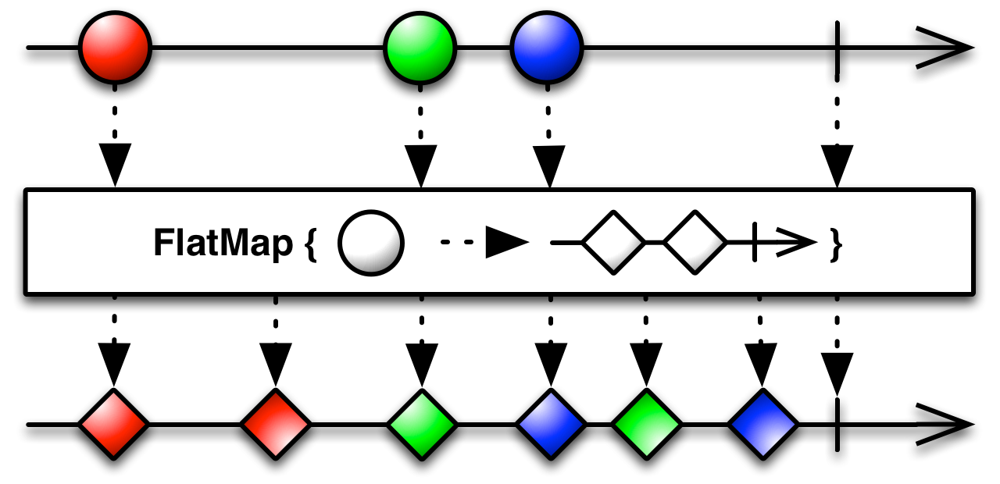

# Android一些开发库的使用
### 一、google的Gson库
#### 1.简单使用
> * **给定JSON数据格式，转成对应的java类**
使用http://www.jsonschema2pojo.org/ ，直接将json格式的数据输入，自动生成对应的java对象
* **使用转换后的java类**
```code
// 例：生成了一个TestExp的类
final TestExp testExp = new Gson().fromJson(jsonStr, TestExp.class);
// 通过上面的语句，就将jsonStr的json格式的字符串转为对应的java类对象
```


#### [Gson库][2]
--------------------------------------------------------------------------
### 二、EventBus
#### 2.1 观察者通常使用的四种处理事件的函数
> * onEvent
* onEventMainThread
* onEventBackground
* onEventAsync

**onEvent：**事件的相应是根据事件发布所在线程一致。

**onEventMainThread：**不论事件发布者所在的线程，接收事件处理都在UI主线程执行。

**onEventBackground：**如果发布者所在线程是UI线程，则处理会在子线程中处理；如果是在子线程中发布事件，则就在该子线程中处理。

**onEventAsync：**无论哪个线程发布事件，均创建子线程进行事件处理。

#### 2.2 事件通知的函数
> * EventBus.post
* EventBus.postSticky

EventBus的register会通过反射获取所注册的class中所有以onEvent打头的成员函数（即是上面提到四类处理事件函数）
调用post函数时，分发事件，吊起接受相应事件的类的对应处理函数，根据其不同的线程模型和设置的优先级进行相应接收事件处理。

#### [EventBus库][2]
--------------------------------------------------------------------------
### 三、RxJava
##### [ReactiveX介绍][6]

#### 3.1 基础
响应式编程的基本组成：`Observables`（发送消息）和`Subscribes`（处理消息）。
一个基本的使用：
```java
Observable.just("Hello, world!")
    .subscribe(new Action1<String>() {
        @Override
        public void call(String s) {
              System.out.println(s);
        }
    });

// 引入retrolambda的lumbda表达式后的写法
Observable.just("Hello, world!")
	.subscribe(s -> System.out.println(s));
```
* 消息的转换操作 Operators
`map`操作用于转换已发送的消息为另一种形式：
```java
	Observable.just("Hello, world!")
		.map(new Func1<String, String>() {
			@Override
			public String call(String s) {
				return s + " -Dan";
			}
		})
		.subscribe(s -> System.out.println(s));

	// lumbda的简化操作
	Observable.just("Hello, world!")
		.map(s -> s + " -Dan")
		.subscribe(s -> System.out.println(s));

	// 希望转换成其他的数据类型
	Observable.just("Hello, world!")
		.map(s -> s.hashCode())			// 将String转成了Integer
		.map(i -> Integer.toString(i))
		.subscribe(s -> System.out.println(s));

	// Observable.from()方法接受一个集合作为输入，然后每次输出一个元素给subscribe
	Observable.from("url1", "url2", "url3")
    .subscribe(url -> System.out.println(url));
```

#### 3.2 Operator更多使用
##### [Operator接口文档][5]
* latMap操作符
flatMap()操作使用原本要被Observable发送的事件，创建一个新的Observable。



#### [RxJava库][3]
###### [retrolambda库][4]
--------------------------------------------------------------------------


[1]:https://github.com/google/gson
[2]:https://github.com/greenrobot/EventBus
[3]:https://github.com/ReactiveX/RxJava
[4]:https://github.com/evant/gradle-retrolambda
[5]:http://reactivex.io/documentation/operators.html
[6]:http://reactivex.io/
