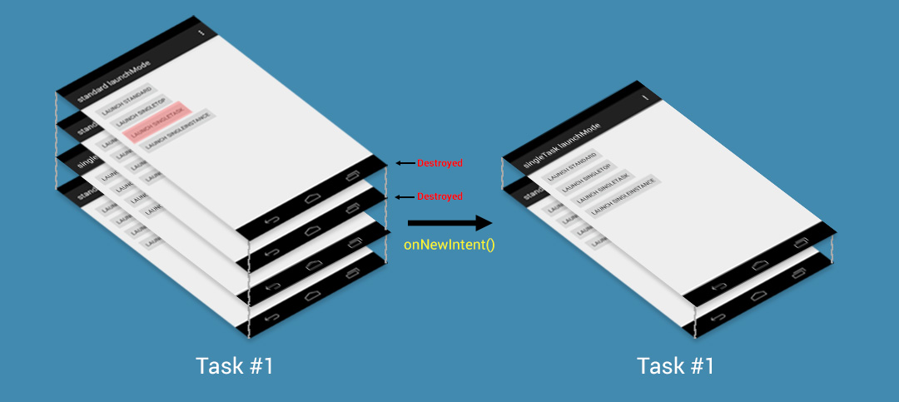
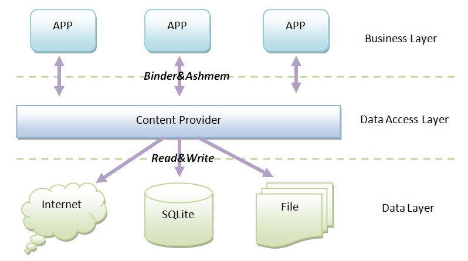

# Android四大组件基础
## 1.Activity
#### 1.1 Activity的使用
* 创建一个继承于android.app.Activity的java类
* 在AndroidManifest.xml文件中声明该类即可

```java
public class Test extends Activity {
	// 做初始化相关的事，必须实现；通过调用setContentView来设置其界面内容。
	@Override
    public void onCreate(Bundle savedInstanceState) {
        super.onCreate(savedInstanceState);
        setContentView(R.layout.main);
    }

	// 当activity停止后，再次start前调用
	@Override
	protected void onRestart() { }
	// 当actvity变得可见时调用
	@Override
	protected void onStart() { }
	// activity重新获取焦点时调用，activity重新进入activity栈顶
	@Override
	protected void onResume() { }
	// activity失去焦点时调用，该activity可能即将stop或者重新获取焦点
	@Override
	protected void onPause() { }
	// activity不可见时调用，该情况可能是新的activity启动或者该activity被销毁(destroyed)
	@Override
	protected void onStop() { }
	// 在activity被destroyed前调用，可能是系统回收资源时触发或者主动调用finish()函数导致
	@Override
	protected void onDestroy() { }
}
```
==Activity生命周期图：==


AndroidMenifest.xml中对activity的申明：
```xml
// android:launchMode 设置activity加载模式
<activity android:name=".Test" android:label="@string/app_name" android:launchMode="standard">
     <intent-filter>
         <action android:name="android.intent.action.MAIN" />
         <category android:name="android.intent.category.LAUNCHER" />
     </intent-filter>
</activity>
```
通过设置`intent-filter`减少组件的耦合，设置`action`和`category`，可以让不同应用之间传递Intent来执行动作和事件。有了`action`就可以为Intent指定相关`action`来调起应用；同时在Intent中指定了`category`，则必须满足`action`与`category`才会调起应用。

#### 1.2 Activity加载模式：
[详细讲解][1]
* standard: 每次启动一个新的activity，都会产生一个新的Activity放到栈顶
* singleTop: 以singleTop模式启动的activity的实例已经存在于栈顶时，如果再启动该Activity不会产生新的实例，直接重新定位栈顶的那个实例，并且会调用onNewIntent函数（如果不在栈顶，则同样会产生一个新的实例）
* singleTask: singleTask模式的Activity只允许在系统中有一个实例，若系统中已经有该实例，持有该实例将出现在栈顶；在同一个应用中需要注意的是如果栈中已经存在该activity，则singleTask activity上的所有activity以合适的方式自动销毁
* singleInstance: 此模式下新Acitvity放置于新栈结构中，并保证不再有其他Activity实例进入
[Activity的task相关][2]

#### 1.3 Activity间通信
从当前activity调起另一个activity：
```java
Intent intent =new Intent(CurrentActivity.this, NewActivity.class);
startActivity(intent);
```
* 使用Intent进行activity间的通信
	* CurrentActivity中调起NewActivity前需要做的塞入数据操作：
	```java
	Intent intent =new Intent(CurrentActivity.this, NewActivity.class);
	// 创建一个包裹内容的bundle
	Bundle bundle =new Bundle();
	bundle.putBoolean("key0", true);
	bundle.putString("key1", "hehe");
	intent.putExtra("data", bundle);
	startActivity(intent);
	```
	* NewActivity中需要做的操作：
	```java
	Intent intent =getIntent();
	if (intent != null) {
		Bundle bundle =intent.getBundleExtra("data");
		boolean key0 = bundle.getBoolean("key0");
		String key1 = bundle.getString("key1");
		// handle key0 and key1
	}
	```
	* Intent 内部有一个bundle，可以直接向Intent中塞数据也可以
	```java
	 // CurrentActivity中的发送
	Intent intent =new Intent(CurrentActivity.this, NewActivity.class);
	intent.putExtra("key0", true);
	intent.putExtra("key1", "hehe");
	startActivity(intent);
	// NewActivity中接收
	Intent intent=getIntent();
	if (intent != null) {
		boolean key0 = intent.getBoolean("key0");
		String key1 = intent.getString("key1");
		// handle key0 and key1
	}
```
* 使用SharedPreferences进行Activity之间的通信
SharedPreferences是为android应用提供的一种持久化的数据存储方式。它存储的数据在`/data/data/app_packagename/shared_prefs/`目录下。应用下的所有activity都可以访问处理。
	```java
	// 写入 SharedPreferences(以xml形式保存SharedPreferences)
	SharedPreferences preferences = getSharedPreferences("sp_file_name", MODE_PRIVATE);
	Editor editor = preferences.edit();
	editor.putBoolean("key0", false);
	editor.putString("key1", "hehe");
	editor.commit();

	// 读取 SharedPreferences
	SharedPreferences preferences = getSharedPreferences("sp_file_name", MODE_PRIVATE);
	preferences.getBoolean("key0", true);
	preferences.getString("key1", "haha");
	```
* 还可使用文件或者sqlite等方式进行通信

对于从当前的页面跳转到新的页面，直接传数据给Intent或者Bundle，再直接调用`startActivity`即可完成数据传递。
如果希望当前的activity（A）跳转到新的activity（B）后，在B操作完成并`finish`掉后，返回数据回来，则需要另一种方式实现。
* startActivityForResult的使用
	```java
	// A activity中需要重写onActivityResult函数
	// 某处跳转操作A -> B
	Intent intent = new Intent(CurrentActivity.this, NewActivity.class);	// 也可以添加数据传递到B
	startActivityForResult(intent, REQUEST_CODE);	// REQUEST_CODE自己设定，控制不同的返回请求

	@Override
	protected void onActivityResult(int requestCode, int resultCode, Intent data) {
		if (REQUEST_CODE == resultCode && RESULT_OK == resultCode) {
			String result = data.getExtras().getString("result"); // 获取B返回的数据
		}
	  }

	// B中销毁操作前的一些数据传输设置
	Intent intent = new Intent();
	intent.putExtra("result", "hehe");
	setResult(RESULT_OK, intent);
	finish();	// 销毁当前B的activity
	```


## 2. Service
#### 2.1 Service的使用
* 创建一个继承于android.app.Service的java类
```java
public class TestService extends Service {
      @Override
      public void onCreate() {
          super.onCreate();
      }
      // service运行时做的操作
      @Override
      public int onStartCommand(Intent intent, int flags, int startId) {
          return super.onStartCommand(intent, flags, startId);
      }
      // 使用bindService()方式启动service时会调用到onBind函数（抽象方法，子类必须实现）
      private SimpleBinder binder = new SimpleBinder();
      @Override
      public IBinder onBind(Intent intent) {
          return binder;	// 以startServie启动service时，可以返回一个null
      }
  }
```
* 在AndroidManifest.xml文件中声明该类
	```xml
	<service android:name=".TestService">
	<!-- android:process 表示该服务是否运行在另外一个进程;设置此项需要以字符串表示另一进程的名字 !-->
	<!-- android:enabled true时表示Service默认会被系统启动 !-->
	</service>
	```
* 启动service的两种方式
	* startService： 一般用于启动一个service执行后台任务；停止service使用stopService函数
	```java
	Intent intent = new Intent(CurrentActivity.this, TestService.class);
	startService(intent);	// 启动service（默认运行在主线程上）
	stopService(intent);	// 关闭服务（不论调用几次startService，只产生一个实例，关闭调用一次即可）
	```
	* bindService：停止时使用unbindService函数
	```java
	/**
	 * 在onBind方法中，利用Binder对象与Activity进行通信
	 * 而客户端需要主动创建一个ServiceConnection类的对象才能接受到Binder对象数据
	 */
	private SimpleBinder binder;
    private ServiceConnection connection = new ServiceConnection() {
        //当服务异常终止时会调用，正常unbindService不会调用
        @Override
        public void onServiceDisconnected(ComponentName name) {
        }
        @Override
        public void onServiceConnected(ComponentName name, IBinder service) {
            binder = (SimpleBinder) service;
            // 通过binder对象，Activity可以指定Service做特定的操作
        }
    };
	// 启动和停止
	Intent intent = new Intent(this, TestService.class);
	bindService(intent, connection, BIND_AUTO_CREATE);	// BIND_AUTO_CREATE：绑定service后会自动创建Service
	unbindService(connection);							// 解绑
	```

* Service的生命周期


* 将Service打造成一个前台的service（系统优先级会因此提高）
	```java
	// 修改Service继承类中的onCreate函数
	 @Override
    public void onCreate() {
        super.onCreate();
        Notification notification = new Notification(R.drawable.app_logo,
                getText(R.string.ticker_text), System.currentTimeMillis());
        Intent notificationIntent = new Intent(this, ExampleActivity.class);
        PendingIntent pendingIntent = PendingIntent.getActivity(this, 0,
                notificationIntent, 0);
        notification.setLatestEventInfo(this, getText(R.string.notification_title),
							getText(R.string.notification_message), pendingIntent);
        startForeground(ONGOING_NOTIFICATION_ID, notification);	// id不能为0
		stopForeground();	// 移除该service是调用，notificaiton在service移除同时也消失
    }
	```
==【注】service一般都是在主线程跑，不同于Thread，如果service配置时设置了process字段会运行在新的进程中，这时需要通过AIDL进行进程间通信；在service中使用thread，可以方便管理thread==

## 3. Broadcast Receiver
#### 3.1 Broadcast Receiver的使用
* 创建一个继承于android.content.BroadcastReceiver的java类
```java
public class TestBR extends BroadcastReceiver {
	@Override
	public void onReceive(Context context, Intent intent) {
		// 处理接收的事件，intent可以携带数据
	}
}
```
* 注册Receiver的两种方式
	* 静态注册：直接在AndroidManifest.xml中注册，任何时候都可以收到broadcast
	```java
	<receiver android:name=".TestBR" >
		<intent-filter>
			<action android:name="com.TestBR"/>
			<category android:name="android.intent.category.DEFAULT"/>
		</intent-filter>
	</receiver>
	```
	* 动态注册：只会在注册的程序运行时才会接收broadcast（一般写法如下）
	```java
	@Override
	protected void onCreate(Bundle savedInstanceState) {
    super.onCreate(savedInstanceState);
    setContentView(R.layout.activity_main);
	// 过滤com.TestBR动作的IntentFilter对象的初始化
    intentFilter = new IntentFilter("com.TestBR");
    receiver = new TestBroadcastReceiver();
}
	@Override
	public void onResume() {
		super.onResume();
		// 注册
		registerReceiver(receiver, intentFilter);
	}
	@Override
	public void onPause() {
		super.onPause();
		// 注销
		unregisterReceiver(receiver);
	}
	// 发一条com.TestBR的广播，并同样可以给intent塞数据
	Intent intent = new Intent("com.TestBR");
	sendBroadcast(intent);
	```
#### 3.2 局部广播（安全性相对高些）
LocalBroadcastManager是在进程内进行的局部广播发送与注册，是Android v4兼容包提供android.support.v4.content.LocalBroadcastManager的工具类
```java
LocalBroadcastManager localBroadcastManager;
BroadcastReceiver receiver;
IntentFilter filter = new IntentFilter("com.TestBR");
receiver = new BroadcastReceiver(){
            @Override
            public void onReceive(Context context, Intent intent) {
                if (intent.getAction().equals("com.TestBR")) {
					// TODO
				}
            }
        };
// 注册
localBroadcastManager = LocalBroadcastManager.getInstance(this);
localBroadcastManager.registerReceiver(receiver, filter);
// 注销
@Override
void onDestroy() {
	super.onDestroy();
	localBroadcastManager.unregisterReceiver(receiver);
}
// 发送广播
LocalBroadcastManager.getInstance(context).sendBroadcast(intent);
```


## 4. Content provider
主要用于不同app之间的数据共享。A应用使用ContentProvider提供相关数据操作接口，B应用可以使用ContentResolver对象通过与ContentProvider同名的方法请求执行，被执行的就是ContentProvider中的同名方法

#### 4.1 Content provider的使用
* 创建一个继承于android.content.ContentProvider的java类
```java
  public class TestContentProvider extends ContentProvider {
      @Override
      public boolean onCreate() {
          return false;
      }
      @Override
      public Cursor query(Uri uri, String[] projection, String selection, String[] selectionArgs, String sortOrder) {
          return null;
      }
      @Override
      public String getType(Uri uri) {
          return null;
      }
      @Override
      public Uri insert(Uri uri, ContentValues values) {
          return null;
      }
      @Override
      public int delete(Uri uri, String selection, String[] selectionArgs) {
          return 0;
      }
      @Override
      public int update(Uri uri, ContentValues values, String selection, String[] selectionArgs) {
          return 0;
      }
  }
```
* Uri在ContentProvider中的使用
Uri的一般格式：<srandard_prefix>://<authority>/<data_path>/<id>
是Android中的一种资源访问方式。在contentprovider中格式为：content://<ContentProvide名>/<请求的数据类型>/<请求的特定数据>
```java
public class StudentsProvider extends ContentProvider {
   static final String PROVIDER_NAME = "com.example.provider.College";
   static final String URL = "content://" + PROVIDER_NAME + "/students";
   static final Uri CONTENT_URI = Uri.parse(URL);

   static final String _ID = "_id";
   static final String NAME = "name";
   static final String GRADE = "grade";

   private static HashMap<String, String> STUDENTS_PROJECTION_MAP;

   static final int STUDENTS = 1;
   static final int STUDENT_ID = 2;

   static final UriMatcher uriMatcher;
   static{
      uriMatcher = new UriMatcher(UriMatcher.NO_MATCH);
      uriMatcher.addURI(PROVIDER_NAME, "students", STUDENTS);
      uriMatcher.addURI(PROVIDER_NAME, "students/#", STUDENT_ID);
   }

   /**
   * Database specific constant declarations
   */
   private SQLiteDatabase db;
   static final String DATABASE_NAME = "College";
   static final String STUDENTS_TABLE_NAME = "students";
   static final int DATABASE_VERSION = 1;
   static final String CREATE_DB_TABLE =
   " CREATE TABLE " + STUDENTS_TABLE_NAME +
   " (_id INTEGER PRIMARY KEY AUTOINCREMENT, " +
   " name TEXT NOT NULL, " +
   " grade TEXT NOT NULL);";

   /**
   * Helper class that actually creates and manages
   * the provider's underlying data repository.
   */
   private static class DatabaseHelper extends SQLiteOpenHelper {
      DatabaseHelper(Context context){
         super(context, DATABASE_NAME, null, DATABASE_VERSION);
      }
      @Override
      public void onCreate(SQLiteDatabase db)
      {
         db.execSQL(CREATE_DB_TABLE);
      }
      @Override
      public void onUpgrade(SQLiteDatabase db, int oldVersion, int newVersion) {
         db.execSQL("DROP TABLE IF EXISTS " +  STUDENTS_TABLE_NAME);
         onCreate(db);
      }
   }

   @Override
   public boolean onCreate() {
      Context context = getContext();
      DatabaseHelper dbHelper = new DatabaseHelper(context);
      /**
      * Create a write able database which will trigger its 
      * creation if it doesn't already exist.
      */
      db = dbHelper.getWritableDatabase();
      return (db == null)? false:true;
   }

   @Override
   public Uri insert(Uri uri, ContentValues values) {
      /**
      * Add a new student record
      */
      long rowID = db.insert(	STUDENTS_TABLE_NAME, "", values);
      /**
      * If record is added successfully
      */
      if (rowID > 0)
      {
         Uri _uri = ContentUris.withAppendedId(CONTENT_URI, rowID);
         getContext().getContentResolver().notifyChange(_uri, null);
         return _uri;
      }
      throw new SQLException("Failed to add a record into " + uri);
   }

   @Override
   public Cursor query(Uri uri, String[] projection, String selection,String[] selectionArgs, String sortOrder) {
      SQLiteQueryBuilder qb = new SQLiteQueryBuilder();
      qb.setTables(STUDENTS_TABLE_NAME);
      switch (uriMatcher.match(uri)) {
         case STUDENTS:
         qb.setProjectionMap(STUDENTS_PROJECTION_MAP);
         break;
         case STUDENT_ID:
         qb.appendWhere( _ID + "=" + uri.getPathSegments().get(1));
         break;
         default:
         throw new IllegalArgumentException("Unknown URI " + uri);
      }
      if (sortOrder == null || sortOrder == ""){
         /**
         * By default sort on student names
         */
         sortOrder = NAME;
      }
      Cursor c = qb.query(db,	projection,	selection, selectionArgs,null, null, sortOrder);
      /**
      * register to watch a content URI for changes
      */
      c.setNotificationUri(getContext().getContentResolver(), uri);
      return c;
   }

   @Override
   public int delete(Uri uri, String selection, String[] selectionArgs) {
      int count = 0;
      switch (uriMatcher.match(uri)){
         case STUDENTS:
         count = db.delete(STUDENTS_TABLE_NAME, selection, selectionArgs);
         break;
         case STUDENT_ID:
         String id = uri.getPathSegments().get(1);
         count = db.delete( STUDENTS_TABLE_NAME, _ID +  " = " + id + 
         (!TextUtils.isEmpty(selection) ? " AND (" + selection + ')' : ""), selectionArgs);
         break;
         default:
         throw new IllegalArgumentException("Unknown URI " + uri);
      }
      getContext().getContentResolver().notifyChange(uri, null);
      return count;
   }

   @Override
   public int update(Uri uri, ContentValues values, String selection, String[] selectionArgs) {
      int count = 0;
      switch (uriMatcher.match(uri)){
         case STUDENTS:
         count = db.update(STUDENTS_TABLE_NAME, values, selection, selectionArgs);
         break;
         case STUDENT_ID:
         count = db.update(STUDENTS_TABLE_NAME, values, _ID + " = " + uri.getPathSegments().get(1) + 
         (!TextUtils.isEmpty(selection) ? " AND (" +selection + ')' : ""), selectionArgs);
         break;
         default:
         throw new IllegalArgumentException("Unknown URI " + uri );
      }
      getContext().getContentResolver().notifyChange(uri, null);
      return count;
   }

   @Override
   public String getType(Uri uri) {
      switch (uriMatcher.match(uri)){
         /**
         * Get all student records
         */
         case STUDENTS:
         return "vnd.android.cursor.dir/vnd.example.students";
         /**
         * Get a particular student
         */
         case STUDENT_ID:
         return "vnd.android.cursor.item/vnd.example.students";
         default:
         throw new IllegalArgumentException("Unsupported URI: " + uri);
     }
  }
}
```
* AndroidManifest.xml中的设置：
```xml
<provider android:name=".StudentsProvider"
	<android:authorities="com.example.provider.College">
</provider>
```
[详细介绍][3]


[1]:http://inthecheesefactory.com/blog/understand-android-activity-launchmode/en
[2]:http://blog.csdn.net/liuhe688/article/details/6761337
[3]:http://www.tutorialspoint.com/android/android_content_providers.htm
