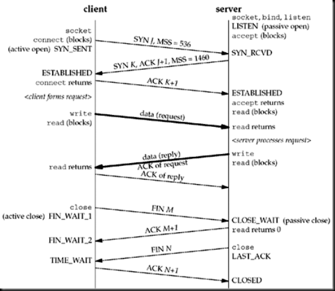

# 网络编程
## 一、基本概念
#### 1.1 UDP（User Data Protocol）
应用进程写一个数据报到UDP套接口，由它封装成IPV4或IPV6的数据报，发往目的地；每个UDP数据报都有一定长度，如果目的地收到了数据报，则接收方应用进程也会收到该数据报的长度。

#### 1.2 TCP（Transport Control Protocol）
TCP的传输特点：
* 提供可靠的数据传输：每发送一次数据，要求对方返回一个确认；TCP含有动态估算Client到Server往返所花的时间（RTT-round trip time）
* TCP通过给所发送数据的每一个字节关联一个序号进行排序
* TCP提供流量控制：TCP总是告诉对方自己能够接受多少字节的数据

#### 1.3 TCP连接的建立和终止
==TCP建立一个连接的流程==
 ① **Server**端必须准备好接受外来的连接（被动打开）：调用socket、bind、listen函数实现
 ② **Client**端通过调用connect进行主动打开：**Client**的TCP发送一个SYN分节（表示同步），告诉服务器将在要建立的连接中发送的数据的初始序列号。一般SYN分节不携带数据，只包含一个IP头部、一个TCP头部以及可能有的TCP选项
 ③ **Server**端必须确认**Client**端的SYN，同时自己也要发送一个SYN分节，告诉客户端将在同一连接中发送的数据的初始序列号。服务器以单个分节向客户端发送SYN和对客户端SYN的ACK
 ④ **Client**端必须确认**Server**端的SYN

**三次握手示意图**

==TCP终止一个连接的流程==
 ① 某个应用进程首先调用close，称该端执行主动关闭（active close），该端TCP发送一个FIN分节，表示数据发送完毕
 ② 接受到FIN的一方执行被动关闭（passive close），这个FIN由TCP确认。他的接收也作为文件结束符传递给接收方应用进程，FIN的接收意味着应用进程在相应的连接再也接收不到额外数据
 ③ 一段时间后，接收到文件结束符的应用进程调用close关闭套接口，会让TCP也发送一个FIN分节
 ④ 原发送方接收到该FIN，TCP对它进行确认

**断开tcp连接示意图**

**TCP状态转换图**

**TCP连接中的分组交换示意图**

#### 1.4 TIME_WAIT状态
由主动关闭的那端进入**TIME_WAIT**状态。该端点留在此状态的时间是最长分节生命期MSL（maximum segment lifetime）的两倍。
MSL是IP数据报能在互联网中生存的最长时间。
**存在TIME_WAIT状态的两个理由：**
> * 实现终止TCP全双工连接的可靠性
* 允许老的重复分节在网络中消逝

因为==TCP连接中的分组交换示意图==可以看出最后一个ACK由client发出后，如果server未收到，这时server会重新发一个FIN，没有该TIME_WAIT维护状态信息的话，client将把新的FIN以RST响应。

#### 1.5 端口号、套接口对
* port的位数：16位
* 标识每个端点的IP地址和端口号称为套接口

#### 1.6 缓冲区大小和限制
* IPv4数据报的最大大小是：65535字节，包括了IPv4头部
* IPv6数据报的最大大小是65575字节，包括40字节的IPv4头部。
* 很多网络有最大传输单元MTU(maximum transmission unit)，有硬件规定
* 两台主机间的路径上的最小MTU称路径MTU（path MTU）。1500字节是以太网MTU，是当今常见的路径MTU
* 当一个IP数据报将从某个接口发出时，如果其大小超过相应链路的MTU，IPv4和IPv6都会执行分片。
* MSS常设置成MTU减去IP和TCP头部的固定长度，MSS的目的是告诉对方自己重组缓冲区大小的实际值，从而避免分片

==TCP数据输出==
* 进程调用write操作时，仅仅是将进程的缓冲区数据拷贝到套接口发送缓冲区中
* TCP取套接口发送缓冲区的数据并发送给对方TCP，同时只有在收到对方发的ACK时，才可以清除缓冲区中已确认的数据

==UDP数据输出==
* UDP的套接口write调用成功的返回表示所有的数据包或所有片段已经被加入链路层的输出队列

## 二、套接口编程

