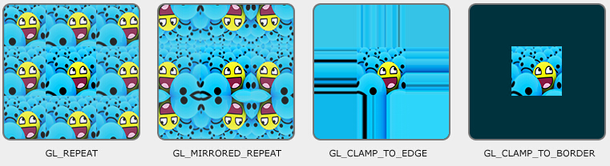
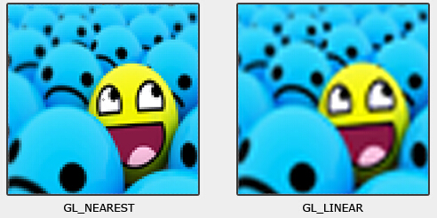
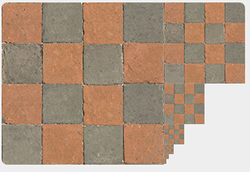

# GLSL
## 一个简单的shader结构
```glsl
#version version_number		// ① version
in type in_variable_name;
in type in_variable_name;	  // ② input and output variables
out type out_variable_name;

uniform type uniform_name;	// ③ uniforms

int main()					// ④ main function
{
  // Process input(s) and do some weird graphics stuff
  ...
  // Output processed stuff to output variable
  out_variable_name = weird_stuff_we_processed;
}
```
> vertex shader中input变量一般为顶点的属性

## 类型Type
#### 1.Vector
```code
vecn:  the default vector of n floats.
bvecn: a vector of n booleans.
ivecn: a vector of n integers.
uvecn: a vector of n unsigned integers.
dvecn: a vector of n double components.

// 一般主要使用vecn，如：vec2、vec4
// 获取单独某位置的值，可以使用.x .y .z 和.w的方式；获取多个值的方法.xyz  .xyzw
vec2 someVec;
vec4 differentVec = someVec.xyxx;

vec2 vect = vec2(0.5f, 0.7f);
vec4 result = vec4(vect, 0.0f, 0.0f);
vec4 otherResult = vec4(result.xyz, 1.0f);
```

#### 2.ins和outs变量
* vertex shader例子
	```code
	#version 330 core

	// The position variable has attribute position 0
	layout (location = 0) in vec3 position;
	// Specify a color output to the fragment shader
	out vec4 vertexColor;
	void main()
	{
		gl_Position = vec4(position, 1.0); // See how we directly give a vec3 to vec4's constructor
		vertexColor = vec4(0.5f, 0.0f, 0.0f, 1.0f); // Set the output variable to a dark-red color
	}
	```

* fragment shader例子
	```code
	#version 330 core

	// The input variable from the vertex shader (same name and same type)
	in vec4 vertexColor;
	out vec4 color;
	void main()
	{
		color = vertexColor;
	}
	```

#### 3.Uniforms
Uniform是另一种从内存传数据到显存的方法；uniforms是全局的，意味着在每一个shader program object中是唯一的。
其数值在reset或者updated之前，在显存中总是保持不变。
```glsl
#version 330 core

out vec4 color;
// We set this variable in the OpenGL code.
uniform vec4 ourColor;

void main()
{
    color = ourColor;
}
```
如上面的ourColor，只在fragment shader中使用，vertex shader中不需要，因为uniform为global的，故不需要经过vertex shader的传递，即可获取该值。
==为了能够在主程序中修改该uniform值，需要获取该uniform attribute的index/location==
* 获取uniform attribute的location函数：<strong style="background:green">glGetUniformLocation(shaderProgram,"uniform attribute name")</strong>
* 设置改uniform attribute值的函数： <strong style="background:yellow">glUniform{n}{f}{v}</strong>
> [注]：查找location时，无需使用shader program， 但是更新uniform值是需要use shader program的。

```c++
// 获取上面fragment shader中的ourColor的示例
GLfloat timeValue = glfwGetTime();
GLfloat greenValue = (sin(timeValue) / 2) + 0.5;
GLint vertexColorLocation = glGetUniformLocation(shaderProgram, "ourColor");
glUseProgram(shaderProgram);
glUniform4f(vertexColorLocation, 0.0f, greenValue, 0.0f, 1.0f);
```
其中**glUniform**有如下后缀函数：
```code
f: the function expects a float as its value
i: the function expects an int as its value
ui: the function expects an unsigned int as its value
3f: the function expects 3 floats as its value
fv: the function expects a float vector/array as its value
```


## 纹理的使用
#### 1.纹理
* 每个vertex都需要有对应的纹理坐标，才能将纹理贴到相应的形状上。
* 纹理坐标范围0~1
* 起始(0,0)对应于纹理的左下角，(1,1)对应于纹理的右上角

#### 2.Texture Wrapping
纹理坐标的范围是0~1，如果坐标值超出，如一个纹理坐标为(2,2),则超出部分会默认使用GL_REPEAT模式
**OpenGL提供的四种超出坐标范围的repeat方式**
* GL_REPEAT： 简单的重复（如果不设置时，默认的repeat方式）
* GL_MIRRORED_REPEAT： 以镜像的形式复制
* GL_CLAMP_TO_EDGE： 超出范围的部分已边界的像素值来填充
* GL_CLAMP_TO_BORDER： 超出坐标范围部分使用通过设置的GL_TEXTURE_BORDER_COLOR颜色来填充


设置方法：
```c++
// s/t/r 分别对应 x/y/z
glTexParameteri(GL_TEXTURE_2D, GL_TEXTURE_WRAP_S, GL_MIRRORED_REPEAT);	// x轴
glTexParameteri(GL_TEXTURE_2D, GL_TEXTURE_WRAP_T, GL_MIRRORED_REPEAT);	// y轴

// 使用GL_CLAMP_TO_BORDER 时，需要同时指出超出部分的border颜色
float borderColor[] = { 1.0f, 1.0f, 0.0f, 1.0f };
glTexParameterfv(GL_TEXTURE_2D, GL_TEXTURE_BORDER_COLOR, borderColor);
```

#### 3.Texture Filtering
纹理的像素值与纹理坐标之间的映射，有两个重要的设置选项：GL_NEAREST 和GL_LINEAR。
* GL_NEAREST为默认的filter方式，即选取与纹理坐标最近对应的像素点的值
* 和GL_LINEAR 是通过选取周围相近像素点的均值
将低分辨率纹理贴到大尺寸对象上，两种不同模式的filtering得到的显示结果如下：

具体代码设置如下：
```code
glTexParameteri(GL_TEXTURE_2D, GL_TEXTURE_MIN_FILTER, GL_NEAREST);
glTexParameteri(GL_TEXTURE_2D, GL_TEXTURE_MAG_FILTER, GL_LINEAR);
```

#### 4.Mipmaps
用于不同视角距离下，纹理的显示优化（静距离下，分辨率高，使用高清晰的纹理；距离太远时，可以使用低分辨率的纹理，提高效率）
A collection of texture images where each subsequent texture is twice as small compared to the previous one.
一个mipmap的texture显示效果如下：

To specify the filtering method between mipmap levels we can replace the original filtering methods with one of the following four options:
* GL_NEAREST_MIPMAP_NEAREST：takes the nearest mipmap to match the pixel size and uses nearest neighbor interpolation for texture sampling.
* GL_LINEAR_MIPMAP_NEAREST：takes the nearest mipmap level and samples using linear interpolation.
* GL_NEAREST_MIPMAP_LINEAR：linearly interpolates between the two mipmaps that most closely match the size of a pixel and samples via nearest neighbor interpolation.
* GL_LINEAR_MIPMAP_LINEAR：linearly interpolates between the two closest mipmaps and samples the texture via linear interpolation.
具体代码设置：
```code
glTexParameteri(GL_TEXTURE_2D, GL_TEXTURE_MIN_FILTER, GL_LINEAR_MIPMAP_LINEAR);
glTexParameteri(GL_TEXTURE_2D, GL_TEXTURE_MAG_FILTER, GL_LINEAR);
```


#### 5.产生纹理
与OpenGL中其它objects一样，用ID来引用纹理
```code
GLuint texture;
glGenTextures(1, &texture);
```
接着需要绑定纹理，使得后面使用纹理相关的命令都配置为刚刚绑定的texture。
绑定之后，接着就可以使用载入的图片数据，来产生纹理了。
**纹理的生成函数：glTexImage2D函数**
```code
glTexImage2D(GL_TEXTURE_2D, 0, GL_RGB, width, height, 0, GL_RGB, GL_UNSIGNED_BYTE, image);
glGenerateMipmap(GL_TEXTURE_2D);
```
==glTexImage2D参数含义==
* GL_TEXTURE_2D 表明产生的纹理与绑定的纹理作用于相同的对象（故任何纹理绑定对象为GL_TEXTURE_1D或G_TEXTURE_3D将不受影响）
* 第二个参数指定mipmap的level
* 第三个参数指定想要存储纹理的数据格式，RGB即存储纹理的rgb值
* 第四、五两参数是图片的宽高
* 第六个参数总是0（历史遗留问题）
* 第7和8参数指定源图片的格式和数据类型
* 最后一个参数为实际的图片数据
在调用glTexImage2D 函数后，绑定的纹理对象即拥有了纹理图片；当前的仅仅是base-level的纹理图片，如果希望使用mipmaps，需要通过给第二个参数赋不同值来指定不同的 或者 在生成纹理后调用glGenerateMipmap函数。它会产生当前绑定的纹理的所有需要的mipmaps。
【注：绑定过后，我们需要将图片的内存释放，已经解绑纹理】
```code
SOIL_free_image_data(image);		// 释放图片内存资源
glBindTexture(GL_TEXTURE_2D, 0);	// 解绑纹理
```

使用纹理时，需要如vertex点传入到vertex shader一样，将纹理坐标传到vertex shader中，然后再传到fragment shader中。
纹理的数据获取：
```code
// shader 程序
uniform sampler2D ourTexture;	// 因为GL_TEXTURE0默认是激活的，所以如果程序中没有通过glUniform设置，也可以在shader中获取相应数据
```
> OpenGL should have a at least a minimum of 16 texture units for you to use which you can activate using GL_TEXTURE0 to GL_TEXTURE15. They are defined in order so we could also get GL_TEXTURE8 via GL_TEXTURE0 + 8 for example, which is useful when we'd have to loop over several texture units.

下面是一个使用两个纹理的程序：
```code
glActiveTexture(GL_TEXTURE0);
glBindTexture(GL_TEXTURE_2D, texture1);
glUniform1i(glGetUniformLocation(ourShader.Program, "ourTexture1"), 0);
glActiveTexture(GL_TEXTURE1);
glBindTexture(GL_TEXTURE_2D, texture2);
glUniform1i(glGetUniformLocation(ourShader.Program, "ourTexture2"), 1);

glBindVertexArray(VAO);
glDrawElements(GL_TRIANGLES, 6, GL_UNSIGNED_INT, 0);
glBindVertexArray(0);

// glUniform1i函数的使用，对于其中第2个参数，0,1对应了相应的纹理
```


