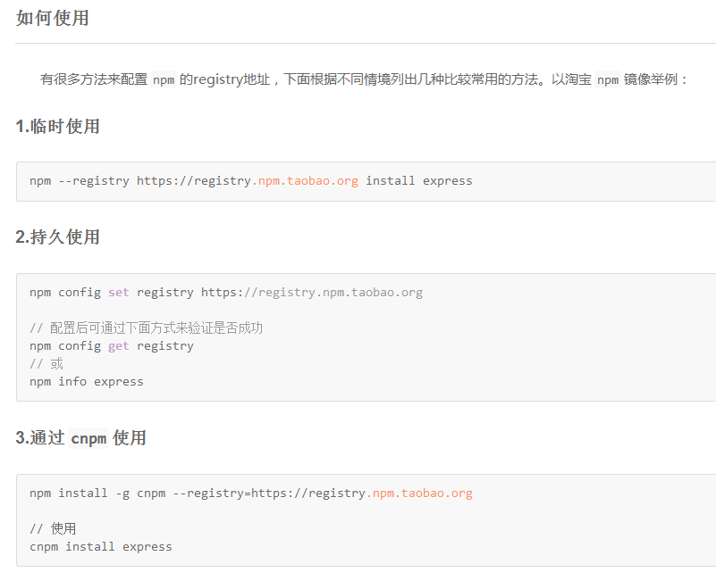

#NetEase - pomelo
## 一、开始
### 安装Node：
> add-apt-repository ppa:chris-lea/node.js
apt-get update
apt-get install nodejs 
==安装了nodejs后，会附带安装npm==
运行`npm -v`，版本应当高于2.1.8，否则运行`sudo npm install npm -g`
>> 如果更行不成功，根据错误内容下载对应版本到本地`https://registry.npmjs.org/npm/-/npm-2.1.18.tgz`;卸载本地的npm：`sudo npm uninstall npm -g`；再解压刚刚的下载的包，进入目录，运行`sudo make install`；查看npm版本`npm -v`；

<strong style="background:red">切换源</strong>
```
	// http://r.cnpmjs.org/ 或者 http://registry.npm.taobao.org/
	npm config set registry https://registry.npm.taobao.org 
	npm info express
```
换源使用方法：


* 测试是否安装成功：
```nodejs
	var http = require('http');
	http.createServer(
		function (req, res) {
			res.writeHead(200, { 'Content-Type' : 'text/plain' } );
			res.end ( 'Hello Node.jsn' );
		}
	).listen(8124, "127.0.0.1");
	console.log('Server running at http://127.0.0.1:8124/');
```
 > 调用： `node hello.js ` 启动服务。 
打开浏览器，输入地址：http://127.0.0.1:8124/， 出现**Hello Node.jsn**则安装成功。

### 安装pomelo
先下载pomelo：`git clone https://github.com/NetEase/pomelo.git`
进入pomelo目录，运行`sudo npm install -g`
> 出错了: npm install node-gyp -g

### pomelo的helloworld测试
* 创建pomelo工程(两种方法):
```shell
// 第一种方法
$ pomelo init ./HelloWorld
// 第二种方法
$ mkdir HelloWorld
$ cd HelloWorld
$ pomelo init
```
**[Pomelo命令行工具使用][1]**

开启game-server服务：

	pomelo start
关闭game-server服务：

	pomelo stop 或者 pomelo kill

开启web-server服务：

	node app


## 2、安装Redis
######[Redis下载][2]
* 启动redis服务：
切换到redis的目录，执行：
```code
$ redis-server.exe
```


## 3、安装Mysql
######[Mysql解压缩版下载][3]
* 需要添加bin目录的路径到系统环境变量
* 配置ini文件中相关变量
```ini
basedir = D:\Program Files\mysql-5.6.22
datadir = D:\Program Files\mysql-5.6.22\data
```
* 运行`mysqld -install`，出现结果为`Service successfully installed.`
* 启动服务：`net start mysql`
* 启动成功后，运行`mysql -uroot -p`，首次登陆密码为空，直接回车即可
==注：ini配置文件的编码必须是英文编码（如windows中的ANSI），不能是UTF-8或GBK等==

```mysql
// root密码修改
> set password for 'root'@'localhost' = password('123456');

// 添加新用户
> insert into mysql.user(Host,User,Password) values('localhost','wangzs',password('123456'));
// 刷新系统权限表
> flush privileges;

// 授权wangzs用户拥有phplamp数据库的所有权限
> grant all privileges on phplampDB.* to wangzs@localhost identified by '123456';
// 刷新系统权限表
> flush privileges;
```


## Pomelo Issue Faq
[Pomelo 常见问题集](http://blog.gfdsa.net/2013/06/26/pomelo/pomelo-faq/)
[编译libpomelo](http://blog.csdn.net/ctbinzi/article/details/39023887)

```
编译过程中出现 error C2371: 'ssize_t' : redefinition; different basic types的错误，这是因为uv-win.h和cocos2d-x3.2中的ccconsole.h头文件重复定义引起的。
解决办法为，uv-win.h中
#if !defined(_SSIZE_T_) && !defined(_SSIZE_T_DEFINED)
typedef intptr_t ssize_t;
# define _SSIZE_T_
# define _SSIZE_T_DEFINED
#endif
把 _SSIZE_T_ 改为 __SSIZE_T，同ccconsole.h中定义的一样即可
```


[1]: https://github.com/NetEase/pomelo/wiki/pomelo命令行工具使用
[2]:https://github.com/MSOpenTech/redis/releases
[3]:http://dev.mysql.com/downloads/mysql/


