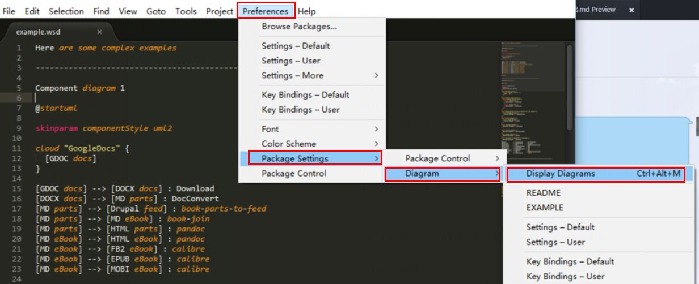

# PlantUML的使用
## 1.安装(windows)
#### 1.1 Sublimez中的安装
* 安装[graphviz][1]：不要修改安装路径（第一次修改后，一直没法渲染出图）
* 安装PlantUML的sublime的[plugin][2]：下载后解压，打开Sublime后，'ctrl+shift+p'输入'Browse'（打开Browse Packages），复制解压目录到刚打开的package目录中（不要修改解压出来的目录名），重启自动载入PlantUML的plugin
* 测试：拷贝一份`Sublime Text 2\Packages\sublime_diagram_plugin-2.5\samples\example.wsd`到任意目录，用sublime打开后，可以通过下图查看是配置正确：

只要有`Display Diagrams`不是灰色，则可以生成图片（如果是灰色，可能是graphviz安装过程自定义了安装路径，系统path中添加其bin目录路径也不行），可以点击`Display Diagrams`显示结果，也可以直接使用快捷键(此处是`ctrl+alt+m`，默认的是`alt+m`)

#### 1.2 Atom中安装
*  安装[graphviz][1]
* 打开`File`-`Settings`-`Packages`中搜索：`PlantUML`，选择安装`plantuml-sublime`即可
* 显示快捷键：`ctrl+alt+p`即可显示

## 2. PlantUML语法

[1]:http://www.graphviz.org/Download_windows.php
[2]:https://github.com/jvantuyl/sublime_diagram_plugin
